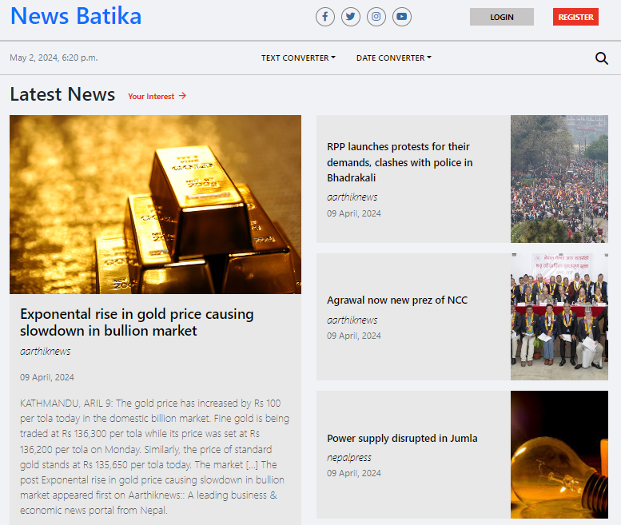

# News Batika

News Batika is a news aggregator system which scrapes news articles from various news portals and displays on the website. We have used python django for backend and HTML,CSS,JavaScript,Bootstraps for frontend.

Our system uses cosine-similarity algorithm to recommend news articles based on the articles read/interacted by the users previously.

Final year project done by: Aayusha, Binda and Lalita.

 

 

